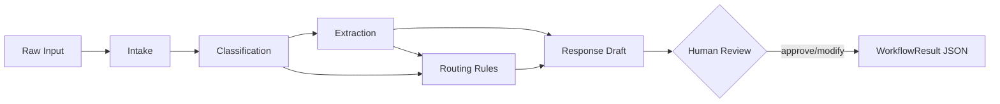

# AI Workflow Intake & Routing Agent

Production-style prototype for **Rozeta Labs** that converts messy incoming business requests (emails, tickets, CRM notes) into structured, routable workflows with an optional human approval layer.

## What it does

```
Raw message → Intake → Classification → Extraction → Routing → Response draft → Human review → JSON output
```

| Step | Module | Responsibility |
|------|--------|----------------|
| 1. Intake | `workflow_agent/steps/intake.py` | Normalize raw text + metadata |
| 2. Classification | `workflow_agent/steps/classification.py` | LLM/rule-based category assignment |
| 3. Extraction | `workflow_agent/steps/extraction.py` | Strict JSON field extraction |
| 4. Routing | `workflow_agent/steps/routing.py` | **Business rules** — team, priority, escalation |
| 5. Response draft | `workflow_agent/steps/response_drafting.py` | Customer reply or internal action note |
| 6. Human review | `workflow_agent/steps/human_review.py` | Approve / modify before finalize |

## Architecture (simple terms)

Think of this as an **operator-facing intake desk**, not a chatbot:

1. **Intake** receives unstructured text (like an email body or ticket description).
2. **Classification** decides *what kind* of request it is (billing, sales, bug, etc.).
3. **Extraction** pulls out the fields operators need: customer name, urgency, summary, required action.
4. **Routing** applies company rules from `config/routing_rules.yaml` — which team owns it, priority 1–5, and whether to escalate.
5. **Response drafting** suggests what to send back (to the customer) or what internal note to leave.
6. **Human review** shows everything and waits for an operator to **approve** or **modify** before the workflow is finalized.

**Separation of concerns:**

- **LLM logic** → `workflow_agent/llm/` (OpenAI or mock provider)
- **Business rules** → `workflow_agent/steps/routing.py` + `config/routing_rules.yaml`
- **Orchestration** → `workflow_agent/orchestrator/pipeline.py`



## Quick start

```bash
pip install -r requirements.txt

# Batch demo (mock mode — no API key needed)
python -m workflow_agent.cli --demo --mock

# Single message
python -m workflow_agent.cli --mock --text "URGENT: API returning 500 errors since deploy"

# Interactive human review
python -m workflow_agent.cli --mock --interactive --text "Need refund for double charge on invoice 9921"

# With OpenAI (set OPENAI_API_KEY in .env)
python -m workflow_agent.cli --text "Enterprise pricing demo request from Acme Corp"
```

## Example inputs

See `examples/sample_inputs.py` — four realistic scenarios:

1. Customer billing dispute (email)
2. Sales enterprise inquiry (CRM note)
3. Internal ops access request (Slack)
4. Production API outage (support ticket)

## Example output shape

After running `--demo --mock`, see `examples/sample_outputs.json`. Each result includes:

```json
{
  "workflow_id": "...",
  "classification": { "category": "billing_issue", "confidence": 0.79, "rationale": "..." },
  "extraction": {
    "customer_name": "Sarah Chen",
    "urgency": "high",
    "issue_summary": "...",
    "required_action": "Audit billing records and reconcile charges"
  },
  "routing": {
    "assigned_team": "Support",
    "priority_score": 5,
    "escalation_needed": true,
    "escalation_target": "Finance + Support Lead"
  },
  "response_draft": { "draft_type": "customer_reply", "content": "..." },
  "human_review": { "review_status": "approved", "reviewer_notes": "..." }
}
```

## Configuration

Edit `config/routing_rules.yaml` to change:

- Categories and keyword hints (mock mode)
- Team routing matrix
- Priority scores and urgency modifiers
- Escalation thresholds
- LLM model and retry settings

## Production-minded features

- Structured Pydantic models for every step
- Step-level logging (`INFO` by default)
- LLM retry with exponential backoff
- Mock provider for offline demos and CI
- Config-driven routing (no hardcoded team logic in LLM prompts)

## Project layout

```
config/routing_rules.yaml
examples/
  sample_inputs.py
  sample_outputs.json
workflow_agent/
  cli.py
  config/settings.py
  llm/           # OpenAI + mock providers
  models/        # Pydantic schemas
  orchestrator/  # Pipeline coordinator
  steps/         # One module per workflow step
  utils/         # Logging, retry
```


